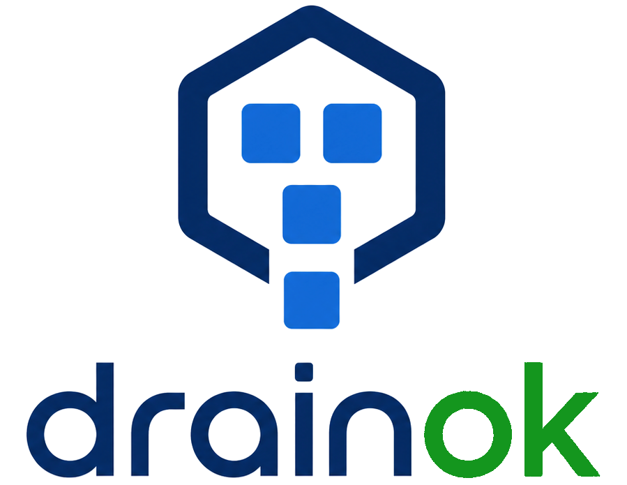

<p align="center">
  <h1 align="center">drainok</h1>
  <p align="center">
    Which nodes in my cluster could I drain right now?
  </p>
</p>

<br />

<p align="center">
  <a href="logo.png">
    
  </a>
</p>

<br />

## Overview

`drainok` checks every node of a Kubernetes cluster against a set of drainability conditions and reports whether a drain would go through cleanly. It is completely **read-only**: nothing is cordoned, nothing is evicted.

```
NODE                    DRAINABLE  BLOCKERS
drainok-control-plane   skipped    control-plane node (use --include-control-plane to evaluate)
drainok-worker          yes        -
drainok-worker2         no         pdb: pod default/web-0 is protected by PodDisruptionBudget "web-pdb" which allows 0 disruptions
                                   fit: pod default/big-app does not fit on any other node (requests 3 cpu, 6Gi memory)
```

Each node is evaluated independently, answering: _"could this node be drained right now, with all other nodes staying up?"_

## Drainability conditions

A node is considered drainable only if **all** checks pass. DaemonSet pods, mirror (static) pods and finished pods are ignored, matching what `kubectl drain` would actually evict.

| Check            | Blocker kinds        | A node is NOT drainable when...                                                                                                                                                                                                                                                                                                                                                                                                                                                                                                                                                                                                       |
| ---------------- | -------------------- | ------------------------------------------------------------------------------------------------------------------------------------------------------------------------------------------------------------------------------------------------------------------------------------------------------------------------------------------------------------------------------------------------------------------------------------------------------------------------------------------------------------------------------------------------------------------------------------------------------------------------------------- |
| `cluster-health` | `cluster-health`     | the node has pods to evict and no other node in the cluster is Ready and schedulable, so those pods have nowhere to go. A node with nothing evictable drains fine and is not flagged.                                                                                                                                                                                                                                                                                                                                                                                                                                                 |
| `reschedule`     | `fit`, `constraints` | a pod cannot be placed on any other node. `constraints`: no other Ready, schedulable node matches the pod's nodeSelector, required node affinity, taints/tolerations, required pod anti-affinity (in both directions: the pod's own terms and those of the pods already on the target), or the node affinity of the PersistentVolumes it is bound to. `fit`: matching nodes exist, but their free capacity (allocatable minus requests of pods already there) cannot hold the pod's CPU/memory requests. Placement is simulated with first-fit-decreasing bin-packing, so pods displaced together compete for the same free capacity. |
| `pdb`            | `pdb`                | a pod is covered by a PodDisruptionBudget that currently allows 0 disruptions (the eviction would be denied and the drain would hang), or by more than one PodDisruptionBudget (the eviction API rejects such pods outright).                                                                                                                                                                                                                                                                                                                                                                                                         |
| `naked-pods`     | `naked-pods`         | a pod has no controller (no ReplicaSet/StatefulSet/Job owner); a drain deletes it and nothing recreates it.                                                                                                                                                                                                                                                                                                                                                                                                                                                                                                                           |
| `local-storage`  | `local-storage`      | a pod uses `emptyDir` or `hostPath` volumes, or a PVC bound to a PersistentVolume whose node affinity pins it to this node (e.g. local PVs); data would be lost or the pod could never start elsewhere. Only Ready, schedulable nodes count as alternative homes for a volume.                                                                                                                                                                                                                                                                                                                                                        |
| `safe-to-evict`  | `safe-to-evict`      | a pod is annotated `cluster-autoscaler.kubernetes.io/safe-to-evict: "false"`.                                                                                                                                                                                                                                                                                                                                                                                                                                                                                                                                                         |
| `machine-config` | `machine-config`     | (OpenShift) the node's Machine Config Daemon reports a `machineconfiguration.openshift.io/state` other than `Done` (`Degraded` and `Unreconcilable` mean the node is stuck; unknown states block too, erring toward "not drainable"), or an update is in flight (`state: Working`, or `currentConfig` differs from `desiredConfig`). Draining collides with the Machine Config Operator, which cordons, drains and reboots the node itself. On non-OpenShift clusters these annotations are absent and the check never fires.                                                                                                         |

Known limitations:

- The resource simulation uses pod **requests**, like the kube-scheduler, not live usage. Pods without requests are simulated as size zero.
- Required pod anti-affinity is evaluated in both directions, but only at hostname level (against pods on the candidate node itself); zone-scoped anti-affinity against pods on other nodes in the same zone is not detected.
- An anti-affinity term with a `namespaceSelector` is treated as matching **all** namespaces, so pods in unrelated namespaces can produce a `constraints` blocker that a real scheduler would not hit.
- Only CPU, memory and pod count are simulated; extended resources (GPUs, hugepages) are not.
- Cluster-scoped upgrade state (OpenShift `ClusterVersion` / `ClusterOperator`) is not inspected; the `machine-config` check covers the per-node consequence of an upgrade, which is what governs whether _this_ node can drain.

Where accuracy has to be traded off, `drainok` errs toward reporting "not drainable": a false blocker is cheaper than a false green light before a drain.

## OpenShift

`drainok` works against OpenShift 4 clusters using only the core Kubernetes API, so no extra configuration is required. Several OpenShift specifics are handled by the generic checks:

- Static control-plane pods (etcd, kube-apiserver, ...) are mirror pods and are ignored, matching `oc adm drain`.
- Platform PodDisruptionBudgets (e.g. `etcd-quorum-guard`) are honoured by the `pdb` check, so a master is correctly blocked while another master is down.
- Control-plane taints (`node-role.kubernetes.io/master`, `.../control-plane`) keep worker pods from being simulated onto masters.
- Project and cluster-default node selectors (`openshift.io/node-selector`) are merged into pod specs at admission, so the `reschedule` simulation already sees them.
- The OpenShift-specific `machine-config` check flags nodes the Machine Config Operator is updating or has marked Degraded (see the table above).

**RBAC:** the built-in `cluster-reader` cluster role grants everything `drainok` reads (nodes, pods, PDBs, PVCs, PVs). Bind it with `oc adm policy add-cluster-role-to-user cluster-reader <user>`.

**emptyDir noise:** many `openshift-*` platform pods use `emptyDir` scratch volumes, so `local-storage` will flag nearly every node. This is deliberate (a drain does discard that data), but if you accept it the way `oc adm drain --delete-emptydir-data` does, skip the check with `--ignore-checks local-storage`.

## Installation

Download a binary from the [releases page](https://github.com/dadav/drainok/releases), or:

```sh
go install github.com/dadav/drainok@latest
```

## Usage

```sh
# Check all nodes of the current kube context
drainok

# Check specific nodes
drainok worker-1 worker-2

# Machine-readable output
drainok --output json

# Skip individual checks
drainok --ignore-checks local-storage,naked-pods

# Evaluate control-plane nodes too
drainok --include-control-plane

# Other cluster / context
drainok --kubeconfig ~/.kube/other-config --context staging
```

### Flags

| Flag                      | Default                           | Description                                                                                                                              |
| ------------------------- | --------------------------------- | ---------------------------------------------------------------------------------------------------------------------------------------- |
| `--kubeconfig`            | `$KUBECONFIG` or `~/.kube/config` | Path to the kubeconfig file                                                                                                              |
| `--context`               | current context                   | Kubeconfig context to use                                                                                                                |
| `-o, --output`            | `table`                           | Output format: `table`, `json` or `yaml`                                                                                                 |
| `--ignore-checks`         | none                              | Comma-separated checks to skip (`cluster-health`, `local-storage`, `machine-config`, `naked-pods`, `pdb`, `reschedule`, `safe-to-evict`) |
| `--include-control-plane` | `false`                           | Evaluate control-plane nodes instead of skipping them                                                                                    |
| `--config`                | `~/.config/drainok/config.yaml`   | Optional config file                                                                                                                     |

Every flag can also be set via environment variable with the `DRAINOK_` prefix (`DRAINOK_OUTPUT=json`, `DRAINOK_IGNORE_CHECKS=pdb,local-storage`) or via the config file:

```yaml
# ~/.config/drainok/config.yaml
output: json
ignore-checks:
  - local-storage
```

Precedence: flags > environment variables > config file > defaults.

### Exit codes

| Code | Meaning                                                          |
| ---- | ---------------------------------------------------------------- |
| `0`  | All evaluated nodes are drainable                                |
| `1`  | At least one evaluated node is not drainable                     |
| `2`  | The analysis itself failed (connection error, unknown node, ...) |

This makes `drainok worker-3 && kubectl drain worker-3 ...` a natural pre-flight check in scripts.

## Development

Requires Go and [just](https://github.com/casey/just).

```sh
just build      # build ./drainok
just test       # run unit tests
just lint       # go vet + golangci-lint (if installed)
just fmt        # gofmt
just run        # go run against the current kube context
just snapshot   # local goreleaser snapshot build
just kind-up    # local 3-node kind test cluster
just kind-down  # tear it down
```

Releases are built by goreleaser via GitHub Actions: every push to `main` builds snapshot binaries, and pushing a `v*` tag publishes a GitHub release for linux/darwin/windows on amd64/arm64.

## License

MIT
